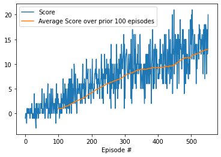
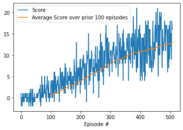
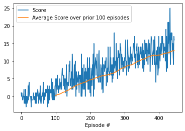
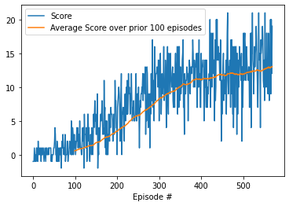
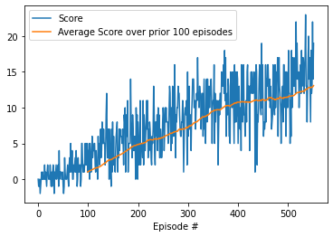
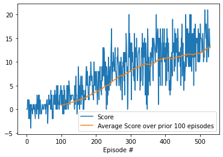

# Project 1: Navigation

## Learning Algorithms

For this project I trained 6 Deep Q-Network (DQN) agents, all based on the code provided for the exercise in the "Deep Q-Networks" lesson of Udacity's *Deep Reinforcement Learning* course: 
1) A basic DQN agent with no improvements beyond those from the initial coding exercise - it solved the environment (achieved an average score of at least 13 over 100 consecutive episodes) in 452 episodes.
2) A double DQN agent - solved the environment in 409 episodes.
3) A dueling DQN agent - solved the environment in 345 episodes.
4) A prioritized experience replay (PER) DQN agent - solved the environment in 470 episodes.
5) An agent using both PER and double Q-learning - solved the environment in 452 episodes.
5) An agent using PER, double Q-learning, and a dueling model - solved the environment in 430 episodes.

The initially selected hyperparameters allowed all the agents to solve the problem, so no optimisation of hyperparameters or model structure was performed.  

|  |
|:--:|
| Comparison of smoothed (running average of 100) scores for each agent |

### Basic DQN Agent

The basic DQN agent - implemented in `dqn_agent.py`, using a model defined in `model.py` - is similar to that described in [this paper](https://storage.googleapis.com/deepmind-media/dqn/DQNNaturePaper.pdf), using the following set of hyperparameters.

		BUFFER_SIZE = int(1e5)  # replay buffer size
		BATCH_SIZE = 128         # minibatch size
		GAMMA = 0.99            # discount factor
		TAU = 1e-3              # for soft update of target parameters
		LR = 5e-4               # learning rate 
		UPDATE_EVERY = 4        # how often to update the network
		eps_start = 1.0
		eps_end = 0.01
		eps_decay = 0.995

When it is run by the method defined in `dqn_runner.py`, the agent selects action with an epsilon greedy policy using epsilon that decays exponentially from eps_start to eps_end at the rate of eps_decay and saves the action and resulting experience in a circular buffer of size BUFFER_SIZE. After accumulating enough experiences, it pulls a random set of BATCH_SIZE experiences and learns from them every UPDATE_EVERY steps.  

The agent maintains two neural network models of the same architecture, a local network that it trains directly and a target network that is updated after each learning step according to the formula:

		tau*local_param.data + (1.0-tau)*target_param.data

To update the local network, first it computes predicted Q values with the local network and target values from the observed rewards and the actions (selected greedily) and values computed by the target network. Then the local network is updated by gradient descent with a learning rate of LR and loss of the mean squared error between the target and predicted values.

Both the local and target networks consist of three linear layers, with the first two followed by ReLU activations. The linear layers dimensions are 37 (the state space size) by 50, 50 by 50, and 50 by 4 (action space size).

### Double DQN Agent

This algorithm, implemented in `double_dqn.py`, is the same as the basic DQN except that the target values used to learn from are computed based on actions chosen greedily based on the values computed by the local network rather than the target network.

It is based on [this paper](https://arxiv.org/abs/1509.06461).

### Dueling DQN Agent

This algorithm is the same as the basic DQN except that it uses a neural network model that computes the Q values by computing single value for the state and "advantage" values for each action which are then added to the state value to get the final Q value. 

Specifically, the advantage and state value computations share a single 37 by 50 linear layer. For the state it is then followed by 50 by 50 and 50 by 1 linear layers. The advantage has a 50 by 50 layer followed by a 50 by 4 layer. Both with ReLU activations after all but the last layer. The final advantage values are then computed by subtracting the max advantage from each, and then they are added to the state value to produce the model's output.  This model is implemented in `dueling_model.py`

This is based on [this paper](https://arxiv.org/abs/1511.06581)

### Prioritized Experience Replay DQN Agent

Again, this is similar to the basic DQN. But, rather than drawing stored experiences randomly to learn from, it draws them with a probability based on the error when the experience was last learned from. Specifically the probability is proportional to: 

		(.1 + abs(err))**a

where `a` decreases linearly from an initial value of .5 to 0 over 150000 steps (500 episodes). To ensure that all experiences have a high chance of being seen once, new experiences are added to the priority queue with an initial priority of 300.  In order to mitigate the bias from these unequal probabilities, experiences are also weighted in the learning process with a factor of:

		((1/N)*(1/P))**b

where `N` is the number of enqueued experiences, `P` is the probability of sampling the experience, and `b` is a parameter that starts at .5 and increases linearly to 1 over 150000 steps.

In order to efficiently sample with the desired probabilities, a sum tree, implemented in `sum_tree.py` is used, as suggested in this [paper describing the algorithm](https://arxiv.org/abs/1511.05952). The BUFFER_SIZE was also increased to 2**14, because using a power of two allowed a simpler sum tree. 

### Double PER DQN Agent

This agent uses both of the adjustments to the basic agent from the double DQN agent and the PER DQN agent. It is implemented - in `Test_Agents.ipynb` - by merely inheriting from both of those.

### Dueling Double PER DQN Agent

This agent uses both of the adjustments to the basic agent from the double DQN agent and the PER DQN agent, as well as the dueling DQN model. It is implemented - in `Test_Agents.ipynb` - by merely inheriting from both of those agents and passing in the dueling model.

### Ideas for Future Work

Better performance could likely be achieved by tuning the hyperparameters and experimenting with different neural network architectures. It was also noticed that using the GPU gave no noticeable speedup over the CPU, probably due to the small state space and simple networks, but perhaps there does exist some method to get a benefit from the GPU. The PER paper also suggested using priority based on the rank of an experience's error rather than proportional to the error - that, or some other prioritization scheme could be tried as well. 

