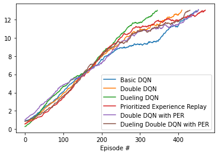

# Project 1: Navigation

## Learning Algorithms

For this project I trained 6 DQN agents, all based on the code provided for the exercise in the "Deep Q-Networks" lesson of Udacity's *Deep Reinforcement Learning* course: 
1) A basic DQN agent with no improvements beyond those from the initial coding exercise   
2) A double DQN agent
3) A dueling DQN agent
4) A prioritized experience replay DQN agent
5) An agent using both PER and double Q-learning
5) An agent using PER, double Q-learning, and a dueling model

### Basic DQN Agent

